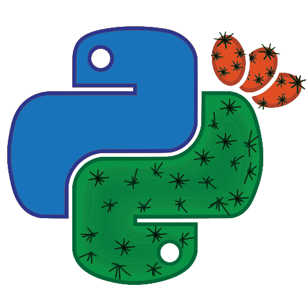

layout: true
class: typo, typo-selection

---

count: false
class: nord-dark, center, middle

.rect.height-35[
	.width-30[
		.center[
			
		]
	]
]

# Liberate your API

#### Building a task manager inside .oc-pink-7[Sanic]

Adam Hopkins
.left.font-sm[
```python
start = datetime(2021, 5, 3, 10, 0, 0, tzinfo=ZoneInfo(key="Asia/Jerusalem"))
end = start + timedelta(minutes=25)
```
]
---

class: border-layout, nord-dark

.east.height-100.width-65.p-xxs.ml-m[
	.card.noborder.noround.m-0.width-100.height-100[
.font-sm[
```python
class Adam:

	def __init__(self):
		self.work = PacketFabric("Sr. Software Engineer")
		self.oss = Sanic("Core Maintainer")
		self.home = Israel("Negev")

	async def run(self, inputs: Union[Pretzels, Coffee]) -> None:
		while True:
			await self.work.do(inputs)
			await self.oss.do(inputs)
		
	def sleep(self):
		raise NotImplemented
```
]
.left[

- [PacketFabric](https://packetfabric.com/) - .font-sm[Network-as-a-Service platform; private access to the cloud; secure connectivity between data centers ]
- [Sanic Framework](https://sanicframework.org/) - .font-sm[ Python 3.7+ `asyncio` enabled framework and server. Build fast. Run fast. ]
- [GitHub - /ahopkins](https://github.com/ahopkins)
- [Twitter - @admhpkns](https://twitter/admhpkns)
		]
	]
]
.west.width-30[
	.pt-xxl.ml-xxl[
		.width-100[
			.center[
				.width-80[
					
				]
				.width-80[
					
				]
				.width-80[
					
				]
			]
		]
	]
]

???

PacketFabric’s Network-as-a-Service platform weaves together a perfect solution for networking. It provides private
access to the cloud, secure connectivity between data centers, an easy on ramp to the secure internet all coupled with
network automation. It's built for the way we do business today. Plus, we were just named one of the Top Ten Hottest
Networking Startups by CRN Magazine,

---

class: nord-dark

# We've built our new web API ...

.rect.height-35[
		.center[
			
		]
]

---

class: nord-dark

# We've built our new web API ...


.block-middle.width-80[
    .center[
	    
    ]
]

---

class: nord-dark

# Our problem...


.block-middle.width-40[
... framework ⛔

... server ⛔

... hosting ⛔

... code ⛔

... slow operations ✅
]

--

```python
async def slow_stuff():
    data = await go_fetch_a_ton_of_data()
    computed = now_run_a_ton_of_computations(data)
```

???

IO v CPU

---

class: nord-dark

# Potential solutions:

1. Third-party package: `celery.send_task("execute_slow_stuff")`

--

2. Background tasks: `app.add_task(slow_stuff())`

--

3. In process task queue

--

4. Subprocess task queue


---

class: nord-dark

# Option 1: .oc-yellow-7[Third-party package]

```python
from celery import Celery

@app.before_server_start
def setup_celery(app, _):
    request.app.ctx.celery = Celery(...)

@app.post("/start_task")
async def start_task(request):
*   task = request.app.ctx.celery.send_task(
        "execute_slow_stuff",
        kwargs=request.json
    )
    return text(f"Started task with {task.id=}", status=202)
```

???

202 status
task ID

---

class: nord-dark

# Option 1: .oc-yellow-7[Third-party package]

```python
@app.post("/check/<task_id:uuid>")
async def check_status(request, task_id: UUID):
    result = app.AsyncResult(task_id)
    result.get()
    serialized = my_serializer(result)
    return json(serialized)
```

---

class: nord-dark

# Option 2: .oc-yellow-7[Background tasks]

```python
async def send_email(user: User):
    ...

@app.post("/registration")
async def user_registration(request):
    user = await do_user_registration(request.json)
*   request.app.add_task(send_email(user))
    return text("Welcome! 👏")
```

???

Good for when you need something to happen but don't need to check on it

If Sanic user, this is a must!

---

class: nord-dark

# Option 3: .oc-yellow-7[In process task queue]

.font-md[
```python
@app.after_server_start
async def setup_task_executor(app, ):
    app.ctx.queue = asyncio.Queue(maxsize=64)
    for x in range(app.config.NUM_TASK_WORKERS)):
        app.add_task(worker(f"Worker-{x}", app.ctx.queue))
```
]
--
.font-md[
```python
async def worker(name, queue):
    while True:
*       job = await queue.get()
        if not job:
            break
        size = queue.qsize()
        logger.info(f"[{name}] Running {job}. {size} in queue.")
*       await Job.create(job)
        await asyncio.sleep(0.1)
```
]

---

class: nord-dark

# Option 3: .oc-yellow-7[In process task queue]

```python
@app.post("/start_task")
async def start_task(request):
*   await request.app.ctx.queue.put("execute_slow_stuff")
    return text("Started task", status=202)
```

???

Notice there is no task ID!

---

class: nord-dark

# Option 3: .oc-yellow-7[In process task queue]

```python
@app.post("/start_task")
async def start_task(request):
    uid = uuid.uuid4()
    await request.app.ctx.queue.put(
        {
            "name": "execute_slow_stuff",
            "uid": uid,
        }
    )
    return text(f"Started task with {uid=}", status=202)
```
???

Suppose you want to have the same functionality as with celery?

- Have a known ID and check its status

HOW CAN WE SCALE?

---

class: nord-dark

# Option 4: .oc-yellow-7[Subprocess task queue]

Requirements:

- Generate unique IDs at execution 🌟
- State of job needs to be stored 💾
- Query job state with unique ID 🧞
- Cannot block HTTP request/response cycle 🟢

---

class: nord-dark, middle, center

# Meet .oc-pink-7[SAJE]

*.oc-gray-6[Sanic Asynchronous Job Executor]*

---

class: nord-dark, middle, center

# Questions?

GitHub - [/ahopkins]()<br />
Twitter - [@admhpkns]()<br />
PacketFabric - [packetfabric.com](https://packetfabric.com/)<br />
.oc-pink-7[Sanic] homepage - [sanicframework.org](https://sanicframework.org)<br />
.oc-pink-7[Sanic] repo - [/sanic-org/sanic](https://github.com/sanic-org/sanic) 
